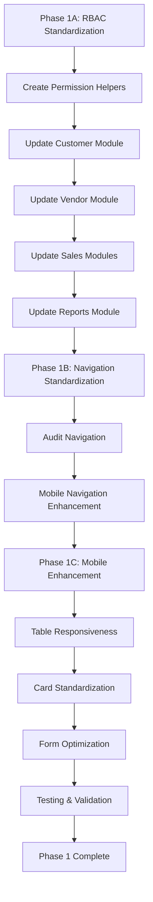

# UX Standardization Plan for Monitorbizz - Phase 1

## Current State Analysis

### Layouts and Templates
- **Main Layout**: `layouts/app.blade.php` uses Tailwind CSS with responsive design
- **Navigation**: Sidebar with collapsible sections (Operations, Sales & Billing, Procurement, Management)
- **Mobile Support**: Separate mobile menu, touch-target classes, responsive utilities

### RBAC Implementation
**Inconsistent across modules:**
- ✅ **Implemented in**: materials, machines, work_orders, purchase_orders
- ❌ **Missing in**: customers, vendors, quotations, invoices, reports

**Permission Methods Used:**
- `auth()->user()->canViewModule('module')`
- `auth()->user()->canCreateInModule('module')`
- `auth()->user()->canEditInModule('module')`
- `auth()->user()->canDeleteInModule('module')`

### Navigation Structure
- **Consistent**: Module-based access control in sidebar
- **Sections**: Operations, Sales & Billing, Procurement, Management
- **Mobile**: Duplicate navigation in mobile menu

### Mobile Responsiveness
- **Strengths**: Responsive grid layouts, mobile menu, touch targets
- **Weaknesses**: Table overflow on mobile, inconsistent card layouts

## Standardization Requirements

### 1. Consistent RBAC Checks Across All Views

**Objective**: Ensure all CRUD operations are protected by appropriate permission checks.

**Implementation Plan:**
- Create a Blade directive or helper for consistent permission checking
- Update all index, show, create, edit views to include permission checks
- Ensure empty states respect permissions

**Affected Views:**
- `customers/index.blade.php` - Add checks for create/view/edit actions
- `vendors/index.blade.php` - Add checks for create/view/edit actions
- `quotations/index.blade.php` - Add checks for create/view/edit actions
- `invoices/index.blade.php` - Add checks for create/view/edit actions
- `reports/index.blade.php` - Add checks for view actions

### 2. Unified Navigation Menu System

**Objective**: Standardize navigation structure with module-based access control.

**Implementation Plan:**
- Ensure all modules follow the same navigation pattern
- Standardize section organization
- Implement consistent active state highlighting

**Current Status**: Navigation is already well-structured, minor refinements needed.

### 3. Mobile-Responsive Design Using Tailwind CSS

**Objective**: Enhance mobile experience with consistent responsive patterns.

**Implementation Plan:**
- Implement responsive table components (stack on mobile)
- Standardize card layouts for mobile
- Ensure consistent spacing and touch targets
- Add mobile-specific optimizations

## Detailed Implementation Steps

### Phase 1A: RBAC Standardization

1. **Create Permission Helper**
   - Add Blade directive for permission checks
   - Standardize permission method calls

2. **Update Customer Module**
   - Add `@if(auth()->user()->canCreateInModule('customers'))` to create buttons
   - Add `@if(auth()->user()->canEditInModule('customers'))` to edit links
   - Add `@if(auth()->user()->canDeleteInModule('customers'))` to delete forms

3. **Update Vendor Module**
   - Same pattern as customers

4. **Update Sales & Billing Modules**
   - Quotations: Add permission checks
   - Invoices: Add permission checks

5. **Update Reports Module**
   - Add view permission checks

### Phase 1B: Navigation Standardization

1. **Audit Navigation Consistency**
   - Ensure all modules have consistent sidebar entries
   - Standardize section organization

2. **Mobile Navigation Enhancement**
   - Ensure mobile menu mirrors desktop structure
   - Add touch-friendly interactions

### Phase 1C: Mobile Responsiveness Enhancement

1. **Table Responsiveness**
   - Implement responsive table component
   - Stack columns on mobile devices
   - Add horizontal scroll indicators

2. **Card Layout Standardization**
   - Consistent card spacing and shadows
   - Mobile-optimized card grids

3. **Form Responsiveness**
   - Ensure all forms work on mobile
   - Optimize input sizes and spacing

## Mermaid Diagram: Implementation Flow

## Success Criteria

- ✅ All CRUD actions protected by appropriate permissions
- ✅ Consistent navigation experience across all modules
- ✅ Mobile-responsive design with no horizontal scrolling issues
- ✅ Touch targets meet accessibility standards (44px minimum)
- ✅ Consistent visual design language

## Risk Mitigation

- **Testing**: Comprehensive testing of permission changes
- **Fallbacks**: Ensure graceful handling of permission denials
- **Documentation**: Update developer guidelines for permission checks
- **Migration**: Gradual rollout to avoid breaking changes

## Timeline Estimate

- Phase 1A: 2-3 days
- Phase 1B: 1 day
- Phase 1C: 2-3 days
- Testing: 1 day

Total: 6-8 days for Phase 1 implementation.